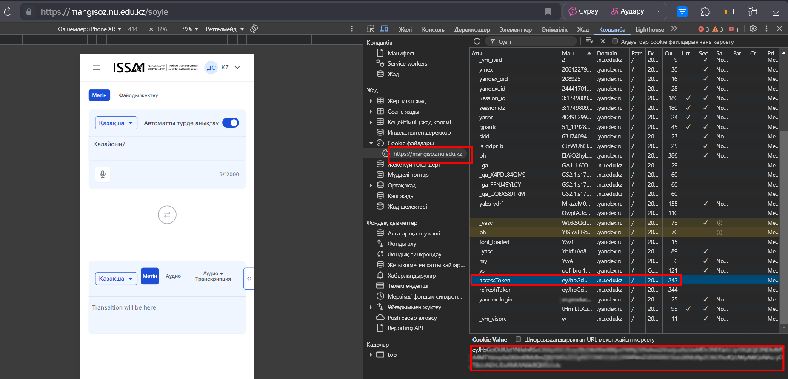

# Personal Assistant Bot Framework with Oylan,Soyle and Beynele API

This is a flexible framework for creating personalized Telegram bots that integrate with the leverages **SoyleTTS**, **SoyleSTT**, and **Oylan2** API for advanced voice and text processing. The Telegram bot works in 4 languages (Kazakh, Russian, English, Turkish).

## Features

- 🤖 **Custom Assistant Creation:** Create your own AI assistant using Oylan 2 API with customizable name, description, and behavior
- 🗣️ **Advanced Voice Processing:**
  - Voice Recognition with automatic language detection
  - Text-to-Speech synthesis
  - Transcription services
- 🌐 **Multilingual Support:** 
  - Supports Kazakh, Russian, English, and Turkish
  - Automatic language detection for voice inputs
  - Language-specific responses
- 📝 **Context Management:**
  - Add and manage context files
  - Support for multiple file types (docx, images)
  - Context-aware responses
- ⚙️ **Easy Configuration:** 
  - Environment-based setup
  - Modular architecture
  - Customizable settings

## Quick Start

### Prerequisites

- Python 3.9+
- Required packages from `requirements.txt`:

```bash
pip install -r requirements.txt
```

### Setup

1. Create a `.env` file with your API keys:

```env
TOKEN=<Your Telegram Bot Token> → https://t.me/BotFather
API_RESPONSE=<Your Oylan API Key> → https://oylan.nu.edu.kz/keys
API_SOYLE=<Your Soyle API Key> → https://mangisoz.nu.edu.kz/keys
API_MAIN_SOYLE=<set accesToken>
API_MAIN_BEYNELE=<set accesToken>
```
How to get accesToken?:
1. Open the browser and go to [https://mangisoz.nu.edu.kz/soyle](https://mangisoz.nu.edu.kz/soyle)
2. Open 'dev tools' (F12)
3. Go to the Application tab → Cookies → https://mangisoz.nu.edu.kz or https://beynele.nu.edu.kz/beynele
4. Copy the value of `accessToken`
5. Paste it into your `.env` file as `API_MAIN_SOYLE=<accessToken>` or `API_MAIN_BEYNELE=<accessToken>`



6. Configure your assistant in `config.py`:
```python
ASSISTANT_ID = 'your_assistant_id'
```

### Creating Your Assistant

You can create and configure your assistant using the provided modules in `cd assistant/`:

1. Create a new assistant using `create.py`:
```bash
py -m create
```
2. Update assistant settings using `update.py`:
```bash
py -m update
```
3. Get assistant information using `get_info.py`:
```bash
py -m get_info
```
4. Add context files using `add_context.py`::
```bash
py -m add_context
```
5. List supported models using `model_list.py`:
```bash
py -m model_list
```

### Creating Your Assistant Context

These scripts allow you to manage context files for your assistant, such as adding, deleting, or retrieving context your assistant. You can also use the context management scripts in `cd context/`:

1. Add a new context using `add_context.py`:
```bash
py -m contexts.add_context
```
2. Delete a context using `delete_context.py`:
```bash
py -m contexts.delete_context
```
3. Get context information using `get_context.py`:
```bash
py -m contexts.get_context
```

### Running the Bot

To start the Telegram bot, simply run the following command in the project root directory:

```bash
python oylan_app.py
```

This will launch your personal assistant bot with all configured features.

## CREDIT ISSAI PLAYGROUND
https://github.com/dauitsuragan002/issai-playground

## License

This project is licensed under the MIT License.

## Contact

For questions or suggestions, please contact:

- https://t.me/david667s
- https://t.me/davidsuragan